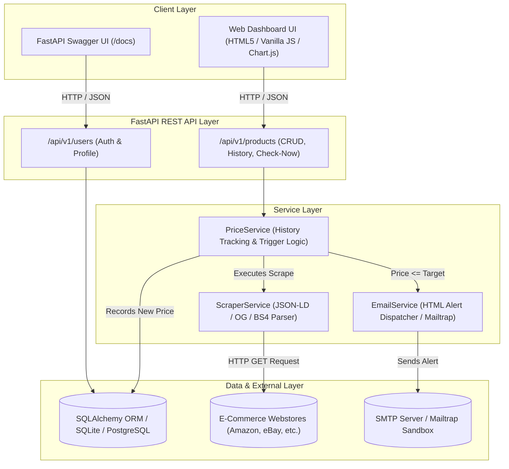

# ⚡ PriceTracker — Full-Stack E-Commerce Price Monitoring System

[](https://fastapi.tiangolo.com)
[](https://python.org)
[](https://www.sqlalchemy.org/)
[](LICENSE)
[](http://127.0.0.1:8000/docs)

A production-grade, full-stack **E-Commerce Price Tracking & Alert System** built with **FastAPI**, **SQLAlchemy ORM**, **BeautifulSoup4**, and an interactive **Modern Web Dashboard**. 

PriceTracker monitors product prices across multiple e-commerce platforms, visualizes historical price fluctuations using **Chart.js**, and triggers automated email alerts when products drop below user-defined target thresholds.

---

## 📑 Table of Contents

- [Key Features](#-key-features)
- [System Architecture](#-system-architecture)
- [Project Structure](#-project-structure)
- [Tech Stack](#-tech-stack)
- [Getting Started](#-getting-started)
  - [Prerequisites](#prerequisites)
  - [Installation](#installation)
  - [Running the Application](#running-the-application)
- [Configuration (.env)](#-configuration-env)
- [Email Alert Setup](#-email-alert-setup)
- [REST API Endpoints](#-rest-api-endpoints)
- [Engineering Highlights](#-engineering-highlights)
- [Contributing & License](#-contributing--license)

---

## 🌟 Key Features

* **Multi-Strategy Scraper Engine**: Resilient extraction engine that automatically falls back through structured data (**JSON-LD**, **OpenGraph tags**, schema microdata, and DOM heuristic selectors) to accurately parse product titles, prices, and currencies across diverse storefronts.
* **Interactive Analytics Dashboard**: Responsive, dark/clean dashboard to search, filter, track, and manage items in real-time with instant toast notifications.
* **Price History & Chart.js Visualization**: Modal analytics chart displaying timestamped price history against user-defined alert thresholds to highlight all-time lows and discounts.
* **On-Demand Price Verification**: One-click manual scraper execution (`/check-now`) allowing users to trigger live web price updates without waiting for cron schedules.
* **Automated Alerting with Deduplication**: Dispatches responsive HTML alert emails with price difference calculations. Includes a **12-hour deduplication window** to prevent notification fatigue.
* **Zero-Config Database**: Seamless local SQLite setup (`pricetracker.db`) out-of-the-box, with instant PostgreSQL compatibility via SQLAlchemy environment config.
* **JWT Authentication**: Secure user registration, login, and token generation using **OAuth2 Bearer tokens** and **Bcrypt** password hashing.
* **Interactive API Documentation**: Auto-generated Swagger UI (`/docs`) and ReDoc (`/redoc`) powered by OpenAPI 3.1.

---

## 🏗️ System Architecture



---

## 📂 Project Structure

The project follows clean architectural principles with strict separation of concerns:

```text
price-tracker/
│
├── app/
│   ├── api/
│   │   └── routes/
│   │       ├── products.py         # Product CRUD, history & on-demand price check endpoints
│   │       └── users.py            # User registration & JWT authentication endpoints
│   │
│   ├── core/
│   │   ├── config.py               # Pydantic Settings & environment variable configuration
│   │   └── security.py             # Bcrypt password hashing & PyJWT token utilities
│   │
│   ├── database/
│   │   ├── base.py                 # SQLAlchemy Declarative Base
│   │   └── session.py              # Engine setup & automatic DB table initialization
│   │
│   ├── models/
│   │   ├── user.py                 # User SQLAlchemy ORM model
│   │   ├── product.py              # Product SQLAlchemy ORM model
│   │   └── price_history.py        # PriceHistory SQLAlchemy ORM model
│   │
│   ├── schemas/
│   │   ├── user.py                 # Pydantic validation schemas for user auth
│   │   └── product.py              # Pydantic validation schemas for products & checks
│   │
│   └── services/
│       ├── scraper.py              # Multi-strategy BeautifulSoup web scraper engine
│       ├── price_service.py        # Scraper orchestration, history logging & alert triggers
│       └── email_service.py        # SMTP / Mailtrap notification delivery service
│
├── static/                         # Frontend Web Client
│   ├── css/style.css               # Clean dashboard styling & responsive layout
│   ├── js/app.js                   # Client-side API integration & Chart.js rendering
│   └── index.html                  # Main Web Dashboard
│
├── .env.example                    # Template configuration file for deployment
├── .gitignore                      # Git exclusion rules (secrets, venv, SQLite DB)
├── LICENSE                         # MIT License
├── requirements.txt                # Pinned Python package dependencies
└── README.md                       # Repository documentation
```

---

## 💻 Tech Stack

| Domain | Technology | Details |
| :--- | :--- | :--- |
| **Backend Framework** | [FastAPI](https://fastapi.tiangolo.com/) | Asynchronous, high-performance web framework |
| **Data Validation** | [Pydantic v2](https://docs.pydantic.dev/) | Strict typing, request validation, and schema definitions |
| **Database & ORM** | [SQLAlchemy 2.0](https://www.sqlalchemy.org/) | Object-relational mapping with SQLite / PostgreSQL support |
| **Web Scraping** | [BeautifulSoup4](https://www.crummy.com/software/BeautifulSoup/) + [Requests](https://requests.readthedocs.io/) | Multi-tier DOM parsing, JSON-LD extraction, custom user-agents |
| **Security & Auth** | [PyJWT](https://pyjwt.readthedocs.io/) + [pwdlib / Bcrypt](https://github.com/Frank-Mayer/pwdlib) | Cryptographic password hashing and JSON Web Token verification |
| **Data Visualization** | [Chart.js](https://www.chartjs.org/) | Responsive canvas charting for price history trends |
| **Frontend UI** | HTML5, CSS3, JavaScript (ES6+) | Clean, responsive dashboard with FontAwesome icons |

---

## 🚀 Getting Started

### Prerequisites
* **Python 3.10+** installed on your system.
* **Git** installed on your system.

---

### Installation

1. **Clone the repository:**
   ```bash
   git clone https://github.com/tejax-bhalerao/price-tracker.git
   cd price-tracker
   ```

2. **Create and activate a virtual environment:**
   * **Windows (PowerShell):**
     ```powershell
     python -m venv venv
     .\venv\Scripts\Activate.ps1
     ```
   * **Linux / macOS:**
     ```bash
     python3 -m venv venv
     source venv/bin/activate
     ```

3. **Install dependencies:**
   ```bash
   pip install -r requirements.txt
   ```

4. **Set up environment variables:**
   ```bash
   # Windows PowerShell
   Copy-Item .env.example .env

   # Linux / macOS
   cp .env.example .env
   ```

---

### Running the Application

Start the development server using Uvicorn:

```bash
uvicorn app.main:app --reload
```

The application will start immediately at `http://127.0.0.1:8000`:
* 🖥️ **Web Dashboard UI**: [http://127.0.0.1:8000/](http://127.0.0.1:8000/)
* 📖 **Interactive Swagger Docs**: [http://127.0.0.1:8000/docs](http://127.0.0.1:8000/docs)
* 📚 **Alternative ReDoc API Specs**: [http://127.0.0.1:8000/redoc](http://127.0.0.1:8000/redoc)
* 🩺 **Health Check**: [http://127.0.0.1:8000/health](http://127.0.0.1:8000/health)

---

## ⚙️ Configuration (.env)

Configuration is managed via Pydantic Settings in `app/core/config.py`:

| Variable | Default Value | Description |
| :--- | :--- | :--- |
| `PROJECT_NAME` | `PriceTracker` | Name of the application displayed in docs and UI |
| `DATABASE_URL` | `sqlite:///./pricetracker.db` | Database connection string (SQLite or PostgreSQL) |
| `SECRET_KEY` | `supersecret_jwt_key...` | Cryptographic secret for signing JWT tokens |
| `ACCESS_TOKEN_EXPIRE_MINUTES` | `1440` (24 Hours) | JWT token lifespan |
| `ENABLE_EMAIL_ALERTS` | `False` | Toggle email alert dispatching (`True` to enable) |
| `SMTP_HOST` | `sandbox.smtp.mailtrap.io` | SMTP server hostname |
| `SMTP_PORT` | `2525` | SMTP port (e.g., `587` for TLS, `2525` for Mailtrap) |
| `SMTP_USER` | `""` | SMTP authentication username |
| `SMTP_PASSWORD` | `""` | SMTP authentication password |
| `EMAILS_FROM_EMAIL` | `alerts@pricetracker.local` | Sender address shown in alert emails |
| `SCRAPER_USER_AGENT` | Chrome User-Agent string | Desktop user-agent header used by requests |
| `SCRAPER_REQUEST_TIMEOUT` | `15` | Timeout in seconds for web scraper requests |

---

## 📧 Email Alert Setup

By default, when `ENABLE_EMAIL_ALERTS=False`, the application operates in **Simulation Mode** — alert triggers are safely logged to your server console:
```text
INFO: [SIMULATION] Email alert triggered for user@example.com: Sony WH-1000XM5 is now $299.99 (Target: $320.00)
```

### To Enable Live Alerts:
1. Open `.env` and set `ENABLE_EMAIL_ALERTS=True`.
2. Configure your SMTP provider credentials:
   * **Testing with [Mailtrap](https://mailtrap.io):** Use your Mailtrap sandbox host, port `2525`, username, and password to test emails safely.
   * **Production with Gmail/Google Workspace:** Set `SMTP_HOST=smtp.gmail.com`, `SMTP_PORT=587`, your email address, and a 16-character Google App Password.

---

## 📡 REST API Endpoints

FastAPI provides full RESTful endpoints under `/api/v1`:

### 📦 Products (`/api/v1/products`)
| Method | Endpoint | Description |
| :--- | :--- | :--- |
| `POST` | `/api/v1/products/` | Add new product to track (initiates initial scrape) |
| `GET` | `/api/v1/products/` | Retrieve all tracked products (supports search & filter) |
| `GET` | `/api/v1/products/{id}` | Get specific product details with price history |
| `PUT` | `/api/v1/products/{id}` | Update target price threshold or active status |
| `DELETE`| `/api/v1/products/{id}` | Delete product and associated history records |
| `POST` | `/api/v1/products/{id}/check-now` | **Trigger on-demand price scrape & alert evaluation** |
| `GET` | `/api/v1/products/{id}/history` | Fetch price timeline points for Chart.js analytics |

### 🔐 Authentication & Users (`/api/v1/users`)
| Method | Endpoint | Description |
| :--- | :--- | :--- |
| `POST` | `/api/v1/users/register` | Register a new user account |
| `POST` | `/api/v1/users/login` | Authenticate and obtain OAuth2 JWT bearer token |
| `GET` | `/api/v1/users/me` | Fetch currently authenticated user profile |

### 🩺 System & Diagnostic
| Method | Endpoint | Description |
| :--- | :--- | :--- |
| `GET` | `/` | Serves dashboard UI frontend |
| `GET` | `/health` | Uptime & service status JSON |
| `GET` | `/info` | API version metadata & links |

---

## 💡 Engineering Highlights

1. **Multi-Stage Scraper Fallback Architecture**:
   E-commerce platforms frequently alter class names to prevent scraping. The scraper checks:
   - `<script type="application/ld+json">` for structured `Product` schema.
   - `<meta property="og:price:amount">` and OpenGraph tags.
   - Regex-based monetary format matching (`$`, `₹`, `€`, `£`) across common price containers.

2. **Smart Alert Deduplication**:
   Price checks run on-demand or via recurring workers. If a price remains below target, users shouldn't receive emails every minute. `PriceService` enforces a minimum **12-hour quiet period** between alerts for the same item unless a new lower price is recorded.

3. **Production Lifespan Management**:
   Leverages FastAPI's modern `@asynccontextmanager` lifespan handler for clean startup database connection verification and table migrations without blocking the event loop.

4. **Security Best Practices**:
   - Environment separation (`.env` strictly excluded via `.gitignore`, template provided as `.env.example`).
   - Passwords hashed with **Bcrypt** algorithm.
   - Protected against SQLite locking through optimized connection pooling settings (`check_same_thread=False`).

---

## 📄 Contributing & License

Contributions, feature requests, and feedback are welcome! Feel free to open an issue or submit a pull request.

Distributed under the **MIT License**. See [`LICENSE`](LICENSE) for more details.

**Author:** [Tejas Bhalerao](https://github.com/tejax-bhalerao)  
**Email:** `tejasbhalerao1901@gmail.com`
